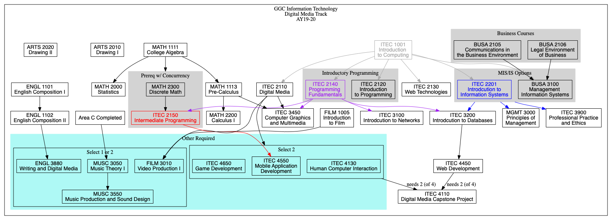
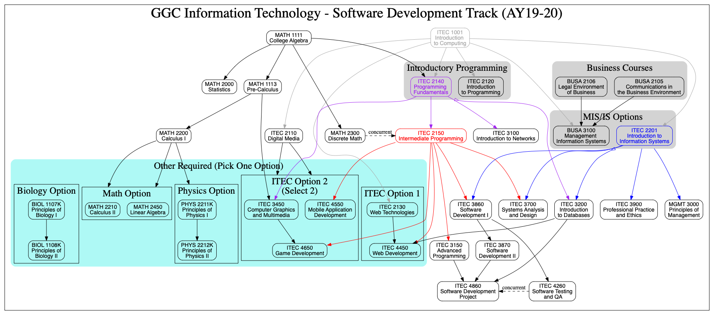

# itec-plans : a landing place for dependency graphs

We use `graphviz` to convert our course dependency chains in different ITEC tracks to directed graphs.

# Steps
Generate directed graphs with:

```bash
$ cd AY19-20
$ dot -Tpdf DataScienceAndAnalytics.dot -o outputs/DataScienceAndAnalytics.pdf
$ dot -Tpdf DigitalMedia.dot -o outputs/DigitalMedia.pdf
$ dot -Tpdf EnterpriseSystems.dot -o outputs/EnterpriseSystems.pdf
$ dot -Tpdf SoftwareDevelopment.dot -o outputs/SoftwareDevelopment.pdf
$ dot -Tpdf SystemsSecurity.dot -o outputs/SystemsSecurity.pdf
```

or simply

```bash
$ cd AY19-20
$ ./build.zsh
```

Please see the `outputs` folder for the generated graphs.

# Latest program plans 

<style>
img.program {
    width: 100%;
}
</style>

Also see [past](PAST.md) and proposed [future changes](CHANGES.md).

## Data Science and Analytics (updated AY20-21, also see [proposed changes](CHANGES.md))

Manual:
[PDF link](AY20-21/manual/DSA-mindmup-fa2019-ITEC4000.pdf)


Graphviz:
[PDF link](AY20-21/outputs/DataScienceAndAnalytics.pdf)


## Digital Media

[PDF link](AY19-20/outputs/DigitalMedia.pdf)


## Enterprise Systems

[PDF link](AY19-20/outputs/EnterpriseSystems.pdf)


## Software Development

[PDF link](AY19-20/outputs/SoftwareDevelopment.pdf)


## Systems Security

[PDF link](AY19-20/outputs/SystemsSecurity.pdf)

